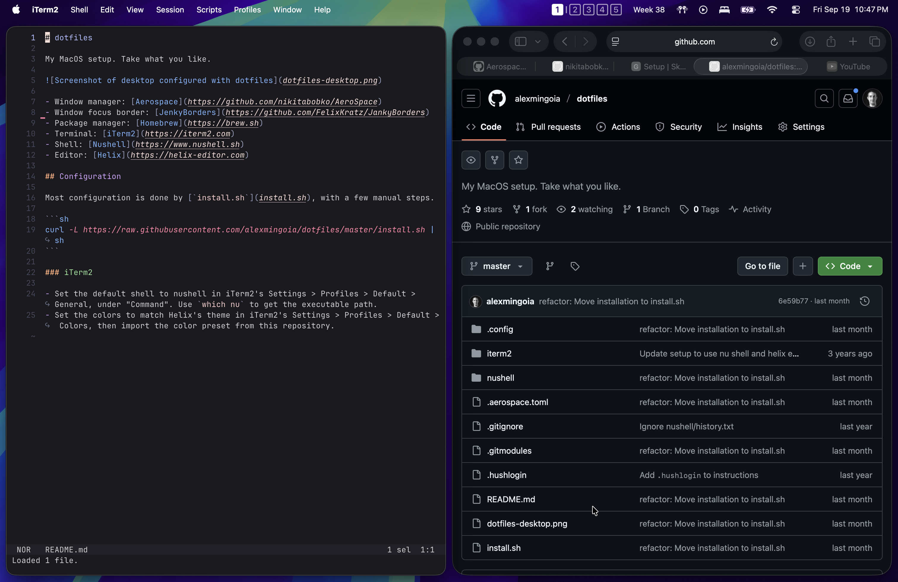

# dotfiles

My MacOS setup. Take what you like.



- Window manager: [Aerospace](https://github.com/nikitabobko/AeroSpace)
- Window focus border: [JenkyBorders](https://github.com/FelixKratz/JankyBorders)
- Menu bar: [Sketchybar](https://github.com/FelixKratz/SketchyBar)
- Package manager: [Homebrew](https://brew.sh)
- Terminal: [iTerm2](https://iterm2.com)
- Shell: [Nushell](https://www.nushell.sh)
- Editor: [Helix](https://helix-editor.com)
  
## Configuration

Most configuration is done by [`install.sh`](install.sh), with a few manual steps.

```sh
curl -L https://raw.githubusercontent.com/alexmingoia/dotfiles/master/install.sh | sh
```

### iTerm2

- Set the default shell to nushell in iTerm2's Settings > Profiles > Default > General, under "Command". Use `which nu` to get the executable path.
- Set the colors to match Helix's theme in iTerm2's Settings > Profiles > Default > Colors, then import the color preset from this repository.
